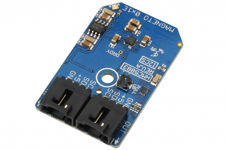

# HMC5883

The Honeywell HMC5883 is a surface mount multi-chip module designed for lowfield magnetic sensing with a digital interface for applications such as low costcompassing and magnetometry. The HMC5883 includes our state of the art,high-resolution HMC118X series magneto-resistive sensors plus Honeywelldeveloped ASIC containing amplification, automatic degaussing strap drivers,offset cancellation, 12-bit ADC that enables 1° to 2° compass heading accuracy.
This Device is available from www.ncd.io 

[SKU: HMC5883_I2CS]

(https://store.ncd.io/?s=hmc5883&post_type=product)
This Sample code can be used with Arduino.

Hardware needed to interface HMC5883 sensor with Arduino

1. <a href="https://store.ncd.io/product/i2c-shield-for-arduino-nano/">Arduino Nano</a>

2. <a href="https://store.ncd.io/product/i2c-shield-for-arduino-micro-with-i2c-expansion-port/">Arduino Micro</a>

3. <a href="https://store.ncd.io/product/i2c-shield-for-arduino-uno/">Arduino uno</a>

4. <a href="https://store.ncd.io/product/dual-i2c-shield-for-arduino-due-with-modular-communications-interface/">Arduino Due</a>

5. <a href="https://store.ncd.io/?s=hmc5883&post_type=product">HMC5883 3Axis Digital Compass Sensor</a>

6. <a href="https://store.ncd.io/product/i%C2%B2c-cable/">I2C Cable</a>

HMC5883:

The Honeywell HMC5883 is a surface mount multi-chip module designed for lowfield magnetic sensing with a digital interface for applications such as low costcompassing and magnetometry. The HMC5883 includes our state of the art,high-resolution HMC118X series magneto-resistive sensors plus Honeywelldeveloped ASIC containing amplification, automatic degaussing strap drivers,offset cancellation, 12-bit ADC that enables 1° to 2° compass heading accuracy.

Applications:

• Mobile phones

• Netbooks

• Consumer electronics

• Auto navigation systems

How to Use the HMC5883 Arduino Library
The HMC5883 is very easy to interface as following.

1.Settings samples per measurement:The following command is used to set the number of samples per measurement as '8'.

             hmc.setMASample(MA_SAMPLE8);                // No. of Samples Averaged per Measurement Output: 8

2.Data rate selection:The following command is used to set the data rate for data transmission.

             hmc.setDataRate(DATA_OUTPUT_RATE_0_75);     // Data Output Rate (Hz): 0.75
            
3.Measurement Mode selection:The following command is used to select the measurement mode as normal .

             hmc.setMeasMode(NORMAL_MEASUREMENT);        // Normal measurement configuration (Default)
           
4.Gain and range selection:The following command is used to set the gain and range of compass sensor. 

             hmc.setMagGain(MAGGAIN_1_3);                // Recommended Sensor Field Range: ± 1.3 Ga, Gain (LSb/Gauss): 1090 (Default), Digital Resolution (mG/LSb): 0.92, Output Range: 0xF800–0x07FF (-2048–2047)  
           
5.Operation mode:The following command is used to set the measurement mode as continuos.

             hmc.setOpMode(CONTINOUS_MEASUREMENT);       // Continuous-Measurement Mode
           
           
